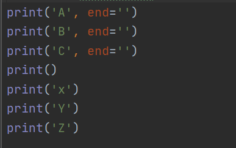
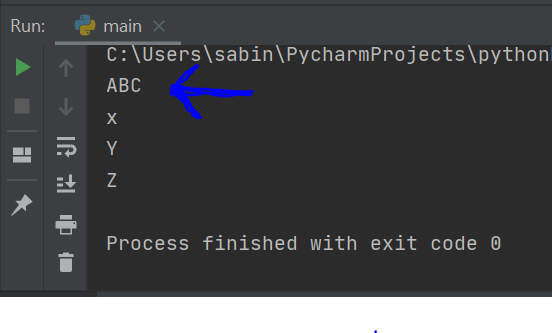
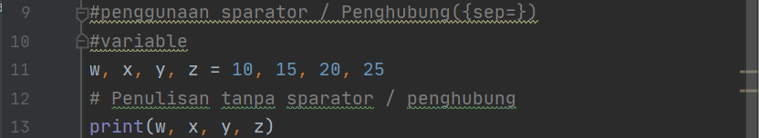
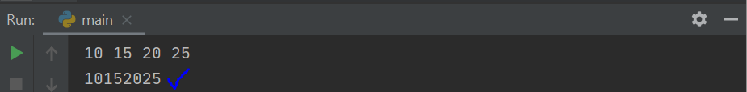
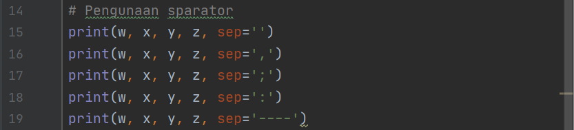
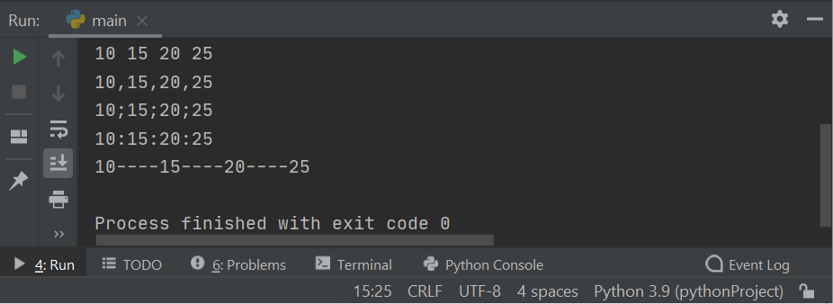

# Pertemuan 6
Mengerjakan  Latihan  Pada Pertemuan 6

======================================

Mata Kuliah	: Bahasa Pemrograman

Dosen		: Agung Nugroho, S.Kom, M.Kom

Nama Mahasiswa	: Sandi Bintara

NIM		: 312010039

Kelas		: TI 20 B1

======================================

## Assalamualaikum
---

# Lab 1

### A. Penggunaan {end=''}
---
> end=''

Penggunaan (end='') untuk membuat huruf sejajar vertikal [*click here](https://core.ac.uk/download/pdf/45375438.pdf) lihat pada halaman 22 untuk keterangan lebih jelas

* Contoh Input ;

* Output ;

### B. Penggunaan Separator / Penghubung {sep=''}
---
> sep=''

Penggunaan sparator adalah untuk menampilkan penghubung sesuai dengan icon penghubung yang di tentukan.

* Contoh ;

1. penulisan tanpa sparator
--

input
-

output
-

2. Penulisan menggunakan sparator
--

input
-

output
-

