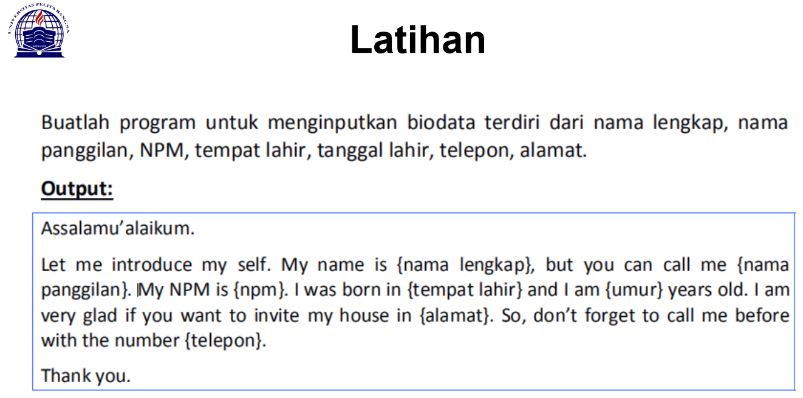
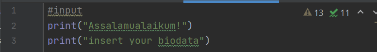
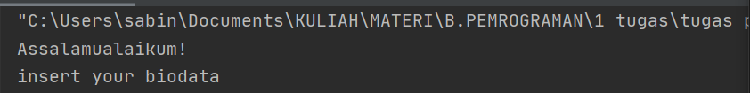
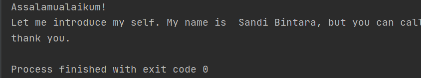
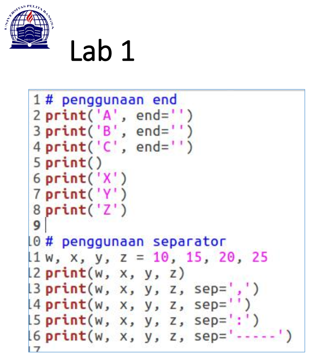
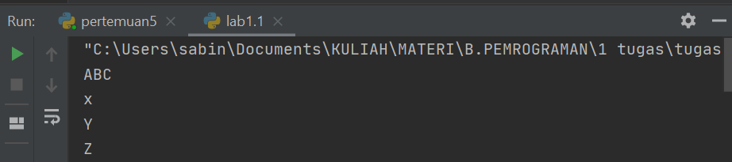

# Pertemuan 6 tugas bahasa pemrograman
Mengerjakan  Latihan  Pada Pertemuan 6

======================================

Mata Kuliah	: Bahasa Pemrograman<br>
Dosen		: Agung Nugroho, S.Kom, M.Kom<br><br>
Nama Mahasiswa	: Sandi Bintara<br>
NIM		: 312010039<br>
Kelas		: TI 20 B1<br>

======================================

# "Assalamualaikum"
---
List Tugas
1. Tugas Pertemuan 5 [click here](#1-tugas-pertemuan-5)
2. Tugas Pertemuan 6 - Lab 1.1[click here](#2-tugas-pertemuan-6---lab-11)
3. Tugas Pertemuan 6 - Lab 1.2[]()
4. Tugas Pertemuan 6 - lab 2[]()
 --

# 1. Tugas Pertemuan 5

Pada pertemuan ke 5 kami di berikan tugas untuk membuat dan menganalisa penggunaan bahasa pemrograman PYHTON


Penulisan tugas sebagai berikut !


````buildoutcfg
#input
print("Assalamualaikum!")
print("insert your biodata")

Nama=input("Please enter your name =")
nama=input("Please enter nickname =")
NIM=input("Please enter your NIM =")
tempatlahir=input("Please enter your place of birth =")
ttl=input("Please enter your date of birth  =")
umur=input("Please enter your age =")
alamat=input("Please enter your adress  =")
email=input("Please enter your email =")
telepon=input("Please enter your phone number =")

#output

print("Assalamualaikum!")
print(f"Let me introduce my self. My name is {Nama}, but you can call me {nama}. My NIM is {NIM}.I was born in {tempatlahir} and i am {umur} years old. I am very glad if you want to invite my house in {alamat}. So, dont forget to call me before with the number {telepon} and my email {email}.")
print("thank you.")
````

* Menggunakan perintah Print

>print("Assalamualaikum")

Berfungsi untuk menampilkan `"Assalamaualaikum"` atau project lainnya sesuai yang akan di inputkan oleh si pengguna.

`hasil`<br>

<br>

`hasil ketika kompile prosess`<br>

<br><br>

* Menggunakan perintah Input

```buildoutcfg
Nama=input("Please enter your name =")
```

Menandai indexs dengan isi yg berbeda contoh; a=gajah maka input a adalah gajah.
 <br><br>
 
* Fungsi huruf f pada perintah print(f"...") adalah fungsi print atau bisa memudahkan programmer dalam mencetak statement dalam satu baris dibandingkan dengan metode yang lama yaitu memisahkan string dan variable dengan simbol koma ( , ) atau plus ( + )<br>
* Sedangkan fungsi {} pada output tersebut adalah untuk menampilkan hasil dari variable.<br>

_contoh;_

```buildoutcfg
print("Assalamualaikum")
print(f"Let me introduce my self. My name is {Nama}, but you can call me {nama}. My NIM is {NIM}.I was born in {tempatlahir} and i am {umur} years old. I am very glad if you want to invite my house in {alamat}. So, dont forget to call me before with the number {telepon} and my email {email}.")

```
<br>`hasil`
<br>

# 2. Tugas Pertemuan 6 - Lab 1.1

Tugas Pertemuan 6



lab1
```buildoutcfg
# lab 1 Penggunaan end
print('A', end='')
print('B', end='')
print('C', end='')
print()
print('x')
print('Y')
print('Z')

# Sparator / Penghubung({sep=})
w, x, y, z = 10, 15, 20, 25

# Penulisan tanpa sparator / penghubung
print(w, x, y, z)

# Penulisan pengunaan sparator
print(w, x, y, z, sep=' ')
print(w, x, y, z, sep=',')
print(w, x, y, z, sep=';')
print(w, x, y, z, sep=':')
print(w, x, y, z, sep='----')
```
* Penggunaan END Penggunaan end digunakan untuk menambahkan karakter yang dicetak di akhir baris. Secara default penggunaan end adalah untuk ganti baris.
<br>
>syntax end=''
```buildoutcfg
print('A', end='')
print('B', end='')
print('C', end='')
```
>tanpa penggunaan syntax end
```buildoutcfg
print('x')
print('Y')
print('Z')
```
>hasil kompile



