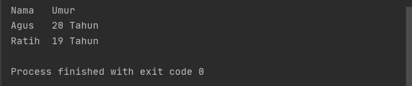

# Pertemuan 6 tugas bahasa pemrograman
Mengerjakan  Latihan  Pada Pertemuan 6

======================================

Mata Kuliah	: Bahasa Pemrograman<br>
Dosen		: Agung Nugroho, S.Kom, M.Kom<br><br>
Nama Mahasiswa	: Sandi Bintara<br>
NIM		: 312010039<br>
Kelas		: TI 20 B1<br>

======================================

# "Assalamualaikum"
---
List Tugas
1. Tugas Pertemuan 5 [click here](#1-tugas-pertemuan-5)
2. Tugas Pertemuan 6 - Lab 1.1[click here](#2-tugas-pertemuan-6---lab-11)
3. Tugas Pertemuan 6 - Lab 1.2[click here](#3-tugas-pertemuan-6---lab-12)
4. Tugas Pertemuan 6 - lab 2[]()
 ---
<br>
# 1. Tugas Pertemuan 5
<br>
Pada pertemuan ke 5 kami di berikan tugas untuk membuat dan menganalisa penggunaan bahasa pemrograman PYHTON
<br>


Penulisan tugas sebagai berikut !
<br>
```buildoutcfg
print("Assalamualaikum!")
print("insert your biodata")

Nama=input("Please enter your name =")
nama=input("Please enter nickname =")
NIM=input("Please enter your NIM =")
tempatlahir=input("Please enter your place of birth =")
ttl=input("Please enter your date of birth  =")
umur=input("Please enter your age =")
alamat=input("Please enter your adress  =")
email=input("Please enter your email =")
telepon=input("Please enter your phone number =")

#output
print("Assalamualaikum!")
print(f"Let me introduce my self. My name is {Nama}, but you can call me {nama}. My NIM is {NIM}.I was born in {tempatlahir} and i am {umur} years old. I am very glad if you want to invite my house in {alamat}. So, dont forget to call me before with the number {telepon} and my email {email}.")
print("thank you.")
```

* Menggunakan perintah Print

>print("Assalamualaikum")

 Berfungsi untuk menampilkan _"Assalamaualaikum"_ atau project lainnya sesuai yang akan di inputkan oleh si pengguna.
<br><br>
_Contoh penggunaan print_
<br>

<br><br>
_hasil_
<br>

<br><br>
* Menggunakan perintah Input
```buildoutcfg
Nama=input("Please enter your name =")
```
Menandai indexs dengan isi yg berbeda contoh; a=gajah maka input a adalah gajah.
 <br>
 <br>
* Fungsi huruf f pada perintah print(f"...") adalah fungsi print atau bisa memudahkan programmer dalam mencetak statement dalam satu baris dibandingkan dengan metode yang lama yaitu memisahkan string dan variable dengan simbol koma ( , ) atau plus ( + )<br>
* Sedangkan fungsi {} pada output tersebut adalah untuk menampilkan hasil dari variable.
<br>
_contoh;_
<br>
```buildoutcfg
print("Assalamualaikum")
print(f"Let me introduce my self. My name is {Nama}, but you can call me {nama}. My NIM is {NIM}.I was born in {tempatlahir} and i am {umur} years old. I am very glad if you want to invite my house in {alamat}. So, dont forget to call me before with the number {telepon} and my email {email}.")
```
<br>
<br>

_hasil_
<br>
<br>
<br>

# 2. Tugas Pertemuan 6 - Lab 1.1
<br><br>
Tugas Pertemuan 6
<br>

<br>
lab1
```buildoutcfg
#lab 1 Penggunaan end
print('A', end='')
print('B', end='')
print('C', end='')
print()
print('x')
print('Y')
print('Z')

#Sparator / Penghubung({sep=})
w, x, y, z = 10, 15, 20, 25

#Penulisan tanpa sparator / penghubung
print(w, x, y, z)

#Penulisan pengunaan sparator
print(w, x, y, z, sep=' ')
print(w, x, y, z, sep=',')
print(w, x, y, z, sep=';')
print(w, x, y, z, sep=':')
print(w, x, y, z, sep='----')
```

* Penggunaan END Penggunaan end digunakan untuk menambahkan karakter yang dicetak di akhir baris. Secara default penggunaan end adalah untuk ganti baris.
>syntax end=''
```buildoutcfg
print('A', end='')
print('B', end='')
print('C', end='')
```

_tanpa penggunaan syntax end_
```buildoutcfg
print('x')
print('Y')
print('Z')
```

_hasil_


* Penggunaan Separator Separator adalah pemisah yang berfungsi sebagai tanda pemisah antar objek yang dicetak. Defaultnya adalah tanda spasi.
<br>

>Deklarasi beberapa variable

```buildoutcfg # Sparator / Penghubung sep=
w, x, y, z = 10, 15, 20, 25
```

> Menampilan variable
```buildoutcfg # Menampilkan tiap hasil variable
print(w, x, y, z)
```

> Menampilkan hasil dari tiap tiap variable menggunakan beberapa jenis icon pemisah.
```buildoutcfg
# Penulisan pengunaan sparator
print(w, x, y, z, sep=' ')
print(w, x, y, z, sep=',')
print(w, x, y, z, sep=';')
print(w, x, y, z, sep=':')
print(w, x, y, z, sep='----')
```

> Hasil dari fungsi di atas


<br>

# 3. Tugas Pertemuan 6 - Lab 1.2

* String Format
  String formatting atau pemformatan string memungkinkan kita menyuntikkan item kedalam string daripada kita mencoba menggabungkan string menggunakan koma atau string concatenation.

Penggubnaan source code yang di berikan pada tugas pertemuan 6 :

```buildoutcfg
# Penggunaan string
# String format

print(0, 10**0)
print(1, 10**1)
print(2, 10**2)
print(3, 10**3)
print(4, 10**4)
print(5, 10**5)
print(6, 10**6)
print(7, 10**7)
print(8, 10**8)
print(9, 10**9)
print(10, 10**10)

print()
print()
print('{0:>3} {1:>16}'.format(0, 10**0))
print('{0:>3} {1:>16}'.format(1, 10**1))
print('{0:>3} {1:>16}'.format(2, 10**2))
print('{0:>3} {1:>16}'.format(3, 10**3))
print('{0:>3} {1:>16}'.format(4, 10**4))
print('{0:>3} {1:>16}'.format(5, 10**5))
print('{0:>3} {1:>16}'.format(6, 10**6))
print('{0:>3} {1:>16}'.format(7, 10**7))
print('{0:>3} {1:>16}'.format(8, 10**8))
print('{0:>3} {1:>16}'.format(9, 10**9))
print('{0:>3} {1:>16}'.format(10, 10**10))
```

  1. String Format 1
  Pada syntax / source code string format 1 akan menampilkan output berupa 2 outputan.
  Yang pertama (sebelah kiri) akan menampilkan angka Urut dari angka 0 hingga angka 10, sedangkan untuk sebelah kanan akan menampilkan Operasi Aritmatika Pangkat.
  Dengan ketentuan sebagai berikut, operasi pangkat dengan angka kiri sebagai pokok (Rumus : ** [bintang dua] )
  Hasil dari syntax tersebut adalah 10 pangkat 0, hingga 10 pangkat 10. dengan output sebagai berikut :"


  2. String Format 2
  Pada syntax atau source code string format 2 akan menampilkan output berupa 2 output'an juga (seperti String Format 1, yaitu kanan dan kiri)
  Dengan ketentuan sebagai berikut :

>Alignment, padding, dan precesion dengan .format() dalam kurung kurawal kita dapat menetapkan panjang bidang, rata kanan/kiri, parameter pembulatan dan banyak lagi. Contoh lain seperti berikut :

```buildoutcfg
print('{0:7}{1:9}'.format('Nama','Umur'))
print('{o:7}{1:9}'.format('Agus','20 Tahun'))
print('{0:7}{1:9}'.format('Ratih','19 Tahun'))
```
_hasil_

